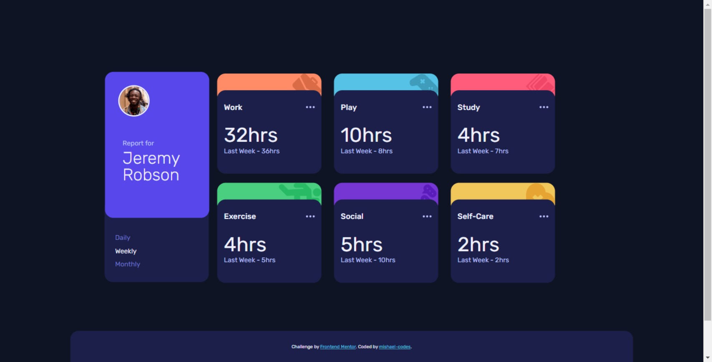

# Frontend Mentor - Time tracking dashboard solution

This is a solution to the [Time tracking dashboard challenge on Frontend Mentor](https://www.frontendmentor.io/challenges/time-tracking-dashboard-UIQ7167Jw). Frontend Mentor challenges help you improve your coding skills by building realistic projects. 

## Table of contents

- [Overview](#overview)
  - [The challenge](#the-challenge)
  - [Screenshot](#screenshot)
  - [Links](#links)
- [My process](#my-process)
  - [Built with](#built-with)
  - [What I learned](#what-i-learned)
  - [Continued development](#continued-development)
  - [Useful resources](#useful-resources)
- [Author](#author)

## Overview

### The challenge

Users should be able to:

- View the optimal layout for the site depending on their device's screen size
- See hover states for all interactive elements on the page
- Switch between viewing Daily, Weekly, and Monthly stats

### Screenshot




### Links

- Solution URL: [Add solution URL here](https://your-solution-url.com)
- Live Site URL: [Add live site URL here](https://your-live-site-url.com)

## My process

### Built with

- Semantic HTML5 markup
- CSS custom properties
- Flexbox
- CSS Grid
- Mobile-first workflow
- JSON
- [Google Fonts](https://fonts.google.com/)

### What I learned

In the course of attempting this project, I learned how to access ```JSON``` data in JavaScript using the ```import``` declaration. I also accessed specific nested data in the ```JSON``` file using both the bracket and dot notation.

### Continued development

I want to learn more about accesing ```JSON``` data in different ways with JavaScript and in future projects, either with [Frontend Mentor](https://www.frontendmentor.io) or not, I look forward to working with ```JSON``` files.

### Useful resources

- [How to access nested json objects in JavaScript?](https://www.tutorialspoint.com/how-to-access-nested-json-objects-in-javascript) - This is one of the resource that helped me to know how to access items in a ```JSON``` file.
- [JavaScript Tip: Loading a Local JSON File without Fetch](https://www.youtube.com/watch?v=Z92PqSyUBSI) - This is also a good resource. It is a youtube video for those like me who better understand concepts through videos.

## Author

- Twitter - [@mishael_codes](https://www.twitter.com/mishael_codes)
- LinkedIn - [Mishael Enyi](https://www.linkedin.com/mishael-enyi)
- Instagram - [@mishael.codes](https://www.instagram.com/mishael.codes)
- Frontend Mentor - [@mishael-codes](https://www.frontendmentor.io/profile/mishael-codes)